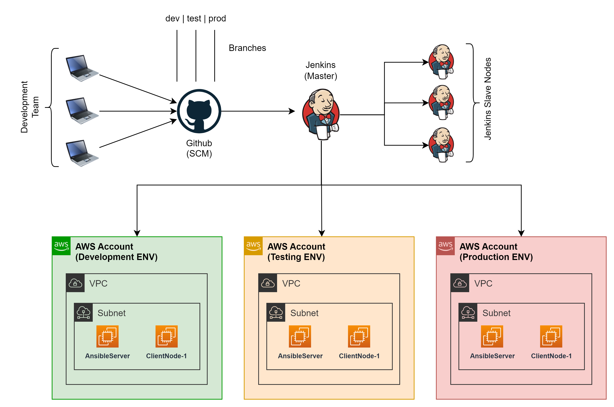

# Project-01: Create and Manage AWS Cloud Infrastructure using Terraform (as IaC) and Jenkins (CI)



## Prerequisites

- [AWS Account](https://aws.amazon.com/free/)
- IDE
  - [Visual Studio Code](https://code.visualstudio.com/download)
- Install VS Code Extensions (Terraform, terraform-lint)
- [Git](https://git-scm.com/downloads)
- [Terraform]()
- [AWS CLI](https://docs.aws.amazon.com/cli/latest/userguide/getting-started-install.html)

## Step-01: Develop and Test Terraform scripts (on local system)

### 1.1 Develop TF scripts

- Get the sample terraform scripts to be deployed from here https://github.com/kbindesh/aws-infra-tf-jenkins-project.

```
# To clone the code on your local system
git clone https://github.com/kbindesh/aws-infra-tf-jenkins-project.git
```

### 1.2 Test the TF scripts locally

```
# Get inside the terraform script folder
cd tf-manifests

# Initialize the directory as a Terraform dir
terraform init

# Validate the Terraform scripts
terraform validate

# Generate the Terraform script plan
terraform plan

# Execute the Terraform scripts to provision AWS resources
terraform apply --auto-approve
```

- If everything looks good, delete all the created resources by running below command as we will be automating resource provisioning using Jenkins in later steps:

```
terraform destroy --auto-approve
```

### 1.3 Create a new remote repository in SCM (Github)

- Create a new repo with at least three branches, namely:
  - Development
  - Testing
  - Production

### 1.4 Check-in the code to SCM (Github)

- Create a new Github repository.
- Check-in the code on **feature branch**.
- Create a PR to merge the changes on Development/Integration branch.
- Approve the PR request and verify the changes on Development branch.

## Step-02: Setup the Jenkins Server (EC2 Instance/VM)

### 2.1 Provision an EC2 Instance

- **AMI**: Amazon Linux 2 (you can have any other OS)
- **Instance Type**: t2.micro
- **VPC & Subnet**: Default
- **Public IP**: Enabled
- **Security Group**: Allow Ingress traffic on SSH(22) and 8080
- **Storage**: Root Volume(at least 10GB)

### 2.2 Install and Configure Jenkins

- Connect to Jenkins server (EC2 Instance)
- Configure Jenkins **On Amazon Linux 2 EC2 Instance**
- Create a new file, say `config-jenkins.sh` and add the following script to it:

```
#!/bin/bash
yum install -y java-17-amazon-corretto.x86_64
wget -O /etc/yum.repos.d/jenkins.repo https://pkg.jenkins.io/redhat-stable/jenkins.repo
rpm --import https://pkg.jenkins.io/redhat-stable/jenkins.io-2023.key
yum -y upgrade
yum install -y jenkins
systemctl start jenkins
systemctl enable jenkins
```

- Execute the above created `config-jenkins.sh` file:

```
sudo sh config-jenkins.sh
```

- **On other platforms**

- Refer to this link: https://www.jenkins.io/doc/book/installing/

### 2.4 Access Jenkins Dashboard

- Open the browser and follow the below link to access the Jenkins service dashboard:

```
http://<jenkins_server_public_ip>:8080

OR

http://<jenkins_server_public_dns_name>:8080
```

- Follow the instructions to install the plugins and create an Admin user.

### 2.3 Create IAM Credentials for Jenkins Server to provision infra in AWS

- Sign-in to your AWS Account
- Navigate to **IAM** >> **Users** >> **Create User**
- **Name**: jenkinsuser
- **Management console access**: No
- IAM Policy: **AdministratorAccess** >> **Create user**
- Once the user account is created, open the User details >> **Security Credentials** >> **Access keys** section >> Create Access key
- Download the keys and keep it handy.

### 2.4 Save the IAM Credentials on Jenkins server

- Access your Jenkins server's dashboard: http://<jenkins_server_public_ip_or_dns>:8080
- From left-side panel, select **Manage Jenkins** >> **Credentials**
- Select scope as **System** >> **Global Credentials** >> **New Credential**

```
# Credential #1
ID: AWS_ACCESS_KEY_ID
SECRET: <YOUR_ACCESS_KEY_HERE>
```

```
# Credential #2
ID: AWS_SECRET_ACCESS_KEY
SECRET: <YOUR_SECRET_ACCESS_KEY_HERE>
```

### 2.5 Create a new Github Webhook for triggering Jenkins jobs

- Navigate to the Github repo created in **Step# 1.3**
- Go to **Setting** tab >> **Webhooks** >> **Add Webhook**
- **Payload URL**: https://<your_jenkins_server_public_ip_or_dns>:8080/github-webhook/
- **Content type**: application/json
- **Which events would you like to trigger this webhook?** : Let me select individual events >> Select **Pull requests** and **Pushes** checkboxes
- Check the **Active** checkbox >> **Create Webhook**

### 2.6 Install and Configure Terraform

```

# On Amazon Linux 2 (AMI)

sudo yum install -y yum-utils shadow-utils
sudo yum-config-manager --add-repo https://rpm.releases.hashicorp.com/AmazonLinux/hashicorp.repo
sudo yum -y install terraform

```

- For more details, refer https://developer.hashicorp.com/terraform/install

### 2.7 Download and Install Git

```
# On Amazon Linux 2
sudo yum install -y git

```

- Refer to this link: https://git-scm.com/downloads

### 2.8 Install Jenkins Plugins

- Navigate to **Manage Jenkins** >> **Plugins** >> **Available Plugins**
- Install following plugins:
  - **Pipeline Stage View Plugin** (https://plugins.jenkins.io/pipeline-stage-view/)
  - **Git** (https://plugins.jenkins.io/git/)
  - **Terraform** (https://plugins.jenkins.io/terraform/)

## Step-03: Create a Jenkins Job (Pipeline | event based) and Trigger it

### 3.1 Create a new Jenkins job of `Pipeline` type

- Go to Jenkins Dashboard >> **New Item**
- **Type**: Pipeline
- **GitHub hook trigger for GITScm polling**: Enable
- Under _Pipeline section_ >>
  - **Definition**: Pipeline script for SCM
  - **SCM**: Git
  - **Repositories URL**: https://github.com/kbindesh/aws-infra-tf-jenkins-project.git
  - **Credentials**: Credentials of your git repo if it is a private one
  - **Branches to build**: <branch_name_of_your_github_repo>
  - **Script Path**: Jenkinsfile

### 3.2 Trigger the Jenkins job manually

- Select the created Jenkins job >> click on **Build now** button

### 3.3 Trigger the Jenkins job automatically

- In order to trigger the jenkins job, push some new code into your Github repo.
- Verify the triggered job from the Jenkins dashboard.

## Step-04: Verify the AWS resources

- Navigate to the AWS Console and verify the created resources.
